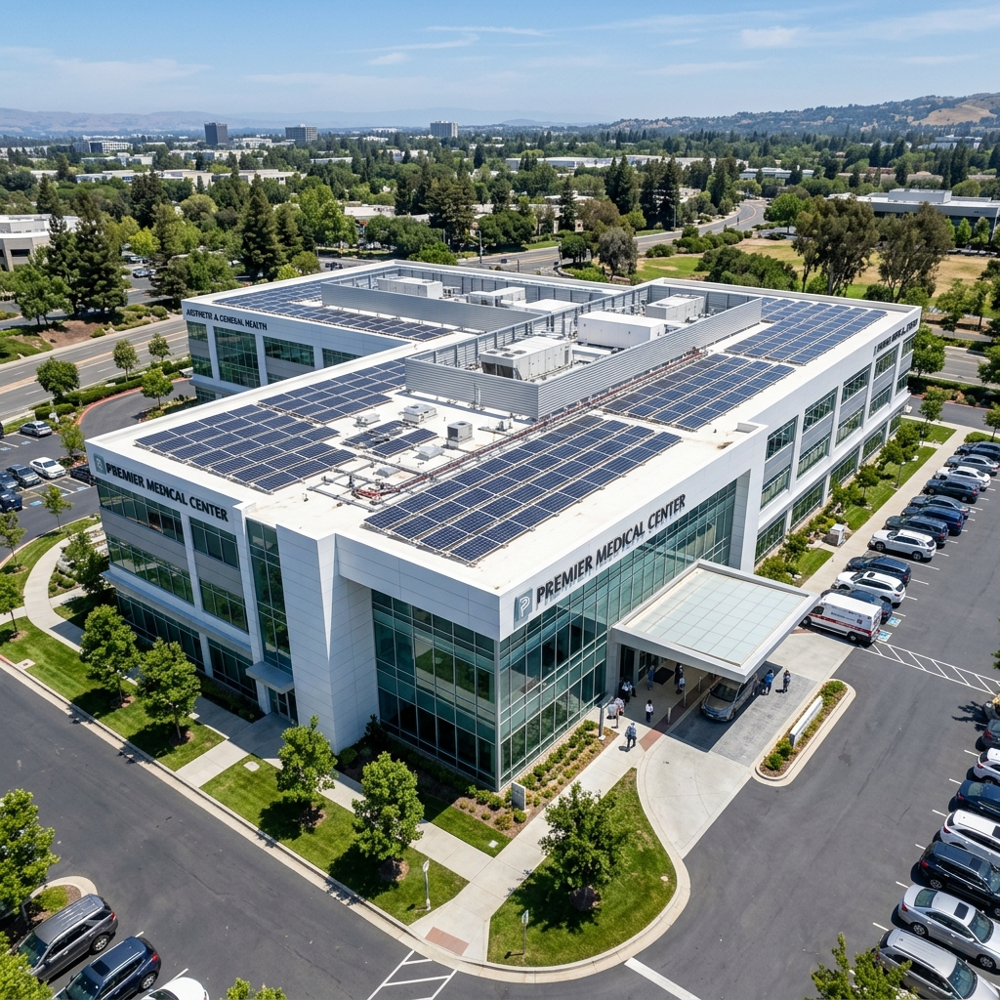

# Solaris - Landing Page Previdenciária


Uma landing page moderna, premium e de alta conversão para serviços previdenciários, construída com Next.js, Tailwind CSS e Framer Motion.

## 🚀 Tecnologias Utilizadas

- **Next.js** (App Router)
- **React**
- **Tailwind CSS**
- **Framer Motion** para animações interativas e micro-interações
- **Shadcn UI** para componentes base
- **Lucide React** para ícones

## 📸 Demonstração

Aqui estão algumas das imagens e estudos de caso do projeto:

| Caso 1 | Caso 2 | Caso 3 |
|:---:|:---:|:---:|
|  |  |  |

## 🛠️ Como executar localmente

1. Clone o repositório:
```bash
git clone https://github.com/Biguelini/solaris.git
```

2. Instale as dependências:
```bash
npm install
```

3. Execute o servidor de desenvolvimento:
```bash
npm run dev
```

4. Acesse [http://localhost:3000](http://localhost:3000) no seu navegador.

## 📂 Estrutura do Projeto

- `src/app`: Páginas da aplicação (incluindo a página principal)
- `src/components/sections`: Seções da landing page (Hero, About, Benefits, Simulator, Testimonials, FAQ)
- `src/components/ui`: Componentes base (botões, inputs, etc)
- `public`: Imagens e assets estáticos
